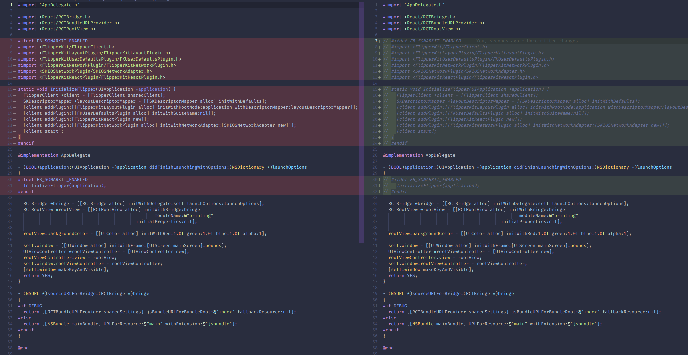

# @tillpos/rn-receipt-printer-utils

*Originally forked from [react-native-thermal-receipt-printer](https://github.com/HeligPfleigh/react-native-thermal-receipt-printer)*

A React Native Library to connect to thermal printer over network and to send the buffer (data to be printed) to thermal printer.


## Installation

```
yarn add @tillpos/rn-receipt-printer-utils
```

## Troubleshoot

- when install in `react-native` version >= 0.60, xcode show this error

```
duplicate symbols for architecture x86_64
```

that because the .a library uses [CocoaAsyncSocket](https://github.com/robbiehanson/CocoaAsyncSocket) library and Flipper uses it too

_Podfile_

```diff
...
  use_native_modules!

  # Enables Flipper.
  #
  # Note that if you have use_frameworks! enabled, Flipper will not work and
  # you should disable these next few lines.
  # add_flipper_pods!
  # post_install do |installer|
  #   flipper_post_install(installer)
  # end
...
```

and comment out code related to Flipper in `ios/AppDelegate.m`



## Support

| Printer    | Android            | IOS                |
| ---------- | ------------------ | ------------------ |
| USBPrinter | :x: |   :negative_squared_cross_mark:|
| BLEPrinter | :heavy_check_mark: | :heavy_check_mark: |
| NetPrinter | :heavy_check_mark: | :heavy_check_mark: |

## Tested on following platforms (manual)

| Platform    | Framework / lib            | Tested                |
| ---------- | ------------------ | ------------------ |
| Android | React Native |   :heavy_check_mark:|
| iOS | React Native | :heavy_check_mark: |

## Development workflow

To get started with the project, run `yarn bootstrap` in the root directory to install the required dependencies for each package:

```sh
yarn bootstrap
```

While developing, you can run the [example app](/example/) to test your changes.

To start the packager:

```sh
yarn example start
```

To run the example app on Android:

```sh
yarn example android
```

To run the example app on iOS:

```sh
yarn example ios
```

To make build

```sh
yarn prepare
```

## Usage

```javascript
import {
  USBPrinter,
  NetPrinter,
  BLEPrinter,
} from "@tillpos/rn-receipt-printer-utils";

BLEPrinter.connectAndSend("xx-xx-xx-xx-xx", "<base64>", ()=>null, ()=>null);
NetPrinter.connectAndSend("xx-xx-xx-xx-xx", 9100, "<base64>", ()=>null, ()=>null);
```

## Example

### NetPrinter

```typescript
interface INetPrinter {
  device_name: string;
  host: string;
  port: number;
  brand?: PrinterBrand;
}
```

_Note:_ get list device for net printers is support scanning in local ip but not recommended

```javascript

  const printer = {
    host: "192.168.10.24", 
    port: 9100,
    device_name: "Sample printer",
    brand: PrinterBrand.EPSON
  }
  _connectPrinter => () => {
    //connect printer
    await NetPrinter.connectAndSend(
      printer.host, 
      printer.port,
      (printer) => console.log("Printed"),
      error => console.warn(error)
    )
  }

  render() {
    return (
      <View style={styles.container}>
        {
            <TouchableOpacity onPress={(printer) => this._connectPrinter()}>
              {`device_name: ${printer.device_name}, host: ${printer.host}, port: ${printer.port}`}
            </TouchableOpacity>
            ))
        }
      </View>
    )
  }

  ...

```


## TODO

- [x] Update documentation
- [ ] Maintain Multiple connections
- [ ] Use `release-it` to publish builds
- [x] Bluetooth support
- [ ] USB support
